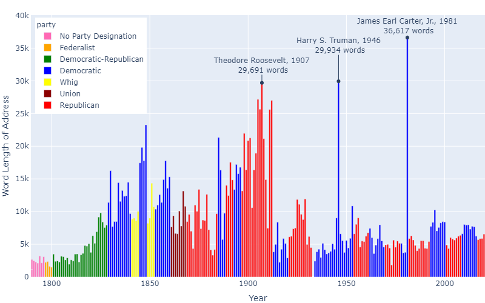
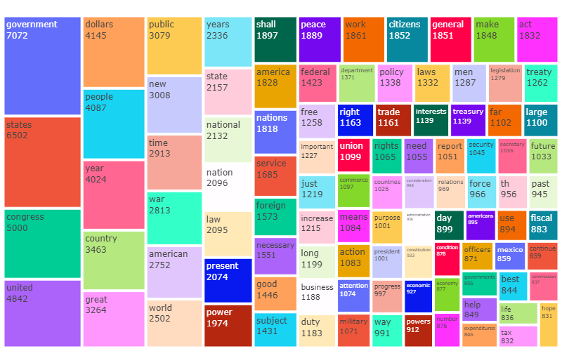
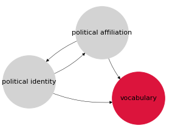
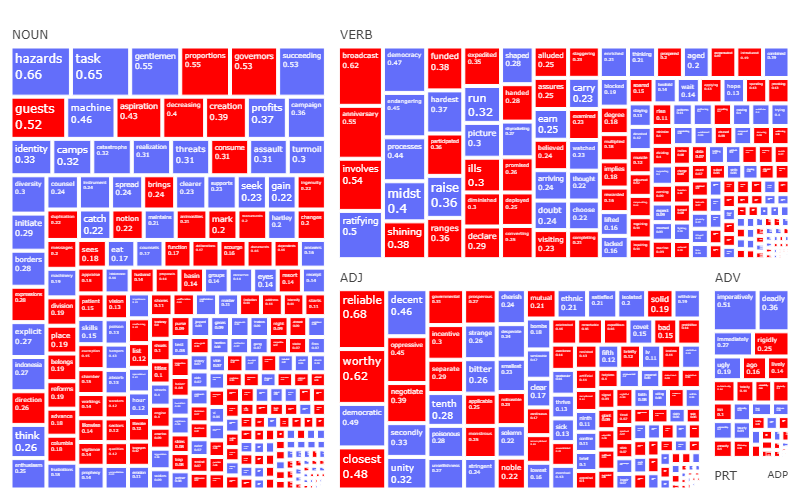
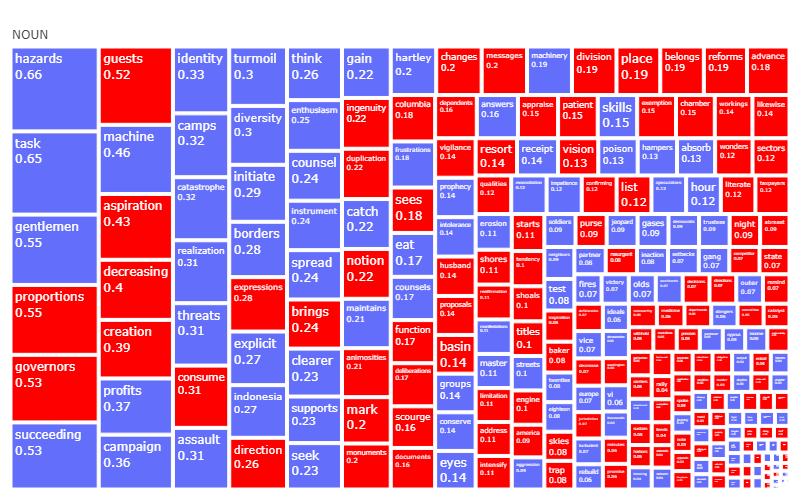
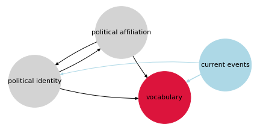
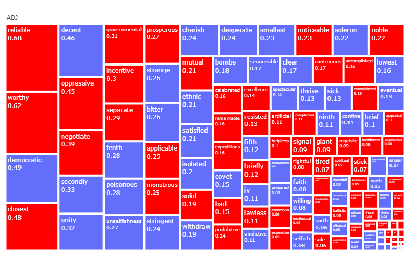

# The State of the Union Address

The State of the Union address is a speech delivered annually by the President of the United States to Congress. The address receives tens of millions of views every year making it an important event in the US political calendar.

This repository features exploratory data analysis of these addresses to date and the creation of a model to predict the political affiliation of 21st Century speeches using parameters estimated from 20th Century speeches.

# Exploratory Analysis Highlights

### Addresses by Year

### Top 100 Most Popular Terms

# The Model

The model was underlined by the following assumptions: 
* The vocabulary used in speeches is a result of the political identity and political affiliation of a President
* A President will be affiliated with the party that best reflects their political identity

The result of the previous assumptions is that whilst the individual political identity of a President may have some effect on the vocabulary used, each address should imply the political affiliation of a President with better than random accuracy.

The goal of the model was to produce an interpretable set of coefficients corresponding to terms used in speeches which had either strong or weak, Democratic or Republican affiliation.

The model used was a logistic regression with L1 regularization controlled by the hyper-parameter C. In deciding this hyper-parameter there was a tradeoff between model performance (accuracy score) and interpretability (number of non-zero coefficents). After performing 5-fold cross validation on the training set, the value of 10 was used as it provided a suitable middle ground. 

Before fitting the model, feature-wise max absolute scaling was performed to ensure that coefficients reflected feature importance rather than feature scale and also that the L1 regularization didn't punish coefficients simply because their underlying feature scale was comparitively low.

# The Results

Out of the 21st Century Presidents, Clinton's speech in 2000 was classified correctly, 75% of both Trump and Obama's speeches were classified correctly and finally only 25% of Bush's speeches were classified correctly.

## Visualizing the Coefficients

* Area denotes absolute coefficient size
* Colour denotes term political affiliation (red : Republican, blue : Democratic)

### All Terms

### Nouns

The significant presence of militaristic terms such as "threats", "assault" and "turmoil" is an interesting feature of the Democratic vocabulary. If we look at major conflicts of the 20th Century this makes contextual sense; during the American involvement in both World Wars aswell as the Korean War, a Democrat was in office throughout. The Cold War and Vietnam War which both spanned several decades had both parties in office but Democratic Presidents were in office during hotspots such as the Berlin Blockade (Truman), Cuban Missile Crisis (Kennedy) and Tet Offensive (Johnson).

Whilst it is certainly true that current events may shape political identity, it is maybe unfair to say that a dialogue on conflict is a characteristic of the Democratic party. Vocabulary used in times of war or world events may be reflective of current political realities rather than philosophies. This highlights that current events may have a direct impact on vocabulary, rather just an indirect impact through the proxy of political identity.

This offers an update to our causal diagram.

### Adjectives

The Republican adjectives such as "reliable", "applicable" and "noticeable" could suggest that concept of practicality is an important part of Republican identity. The adjectives of "oppressive", "prohibitive" and "expensive" alluding to the Republican aversion to both government regulation and government spending.

Modern liberalism, the core component of the Democratic Party's contemporary identity is represented in their term footprint. The adjective of "decent" is reflective of the Democratic stance on minimum wage and the social safety net.

> "We should find a solution to fair housing, so that every American, regardless of color, has a **decent** home of his choice" - President Johnson 1967

The adjectives of "unity" and "un-selfishness" are reflective of the value of collective responsibility, well represented by President Truman in 1948.

>"We seek answers which will embody the moral and spiritual elements of tolerance, **unselfishness**, and brotherhood upon which true freedom and opportunity must rest" - President Truman 1948

## Visualizing the Coefficients in the Context of George W. Bush's Speeches

* Area denotes the absolute log-odds contribution to party classification across all of Bush's speeches
* Colour denotes term political affiliation. 

If all these speeches were grouped together, Bush  (a Republican) would be classified as a Democrat.

### All Terms

The biggest contribution was the noun tag which was overwhelmingly Democratic. While adjectives made the second largest contribution and were majority Republican, net Democratic contributions in both verbs and adverbs ensured that Bush was classified as a Democrat. 

Notable actions of George W. Bush were the commencement of the "War on Terror" following the September 11th attacks in 2001 aswell as the invasion of Iraq in 2003. The militaristic context of Bush's addresses led to him using Democratic nouns such as "threats", "weapons", "assault" and "fight", aswell as the adjective "bombs", adverb "deadly" and particle "attack".

The noun "camps" is an interesting term. It appeared in 20th Century Democratic speeches in a military context (Wilson 1914 & 1917, Roosevelt 1939), a foriegn refugee context (Truman 1948, Carter 1981) and a local context (Clinton 1993 & 1994). Bush used the term to refer to terrorist training camps (2002 & 2003) and also the Nazi concentration camps of World War Two in the context of justifying American intervention in the Middle East in his 2006 address.
